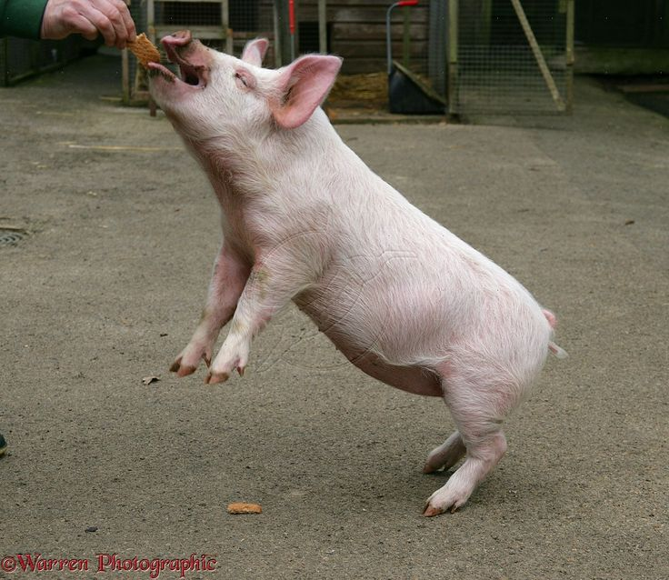

# When Pigs Fly

## Scenario
You know your target is using pretrained resnet50. Can you get `pig.jpg` classified as an airliner?

## Objective
Submit the mask you want applied to `pig.jpg` as a tensor (probably using `torch.save()`).

## Instructions (local)
1. Run `docker build --tag flying_pigs .`
2. Run `docker run -p 5000:5000 flying_pigs:latest`
3. Modify `submission_helper.py` with a path to your tensor or otherwise `POST` your tensor to `http://localhost:5000/check`.

## Acknowledgement
This example was motivated and borrowed heavily from [Adversarial Robustness - Theory and Practice](https://adversarial-ml-tutorial.org). If you struggle with it, this will be a great resource.
